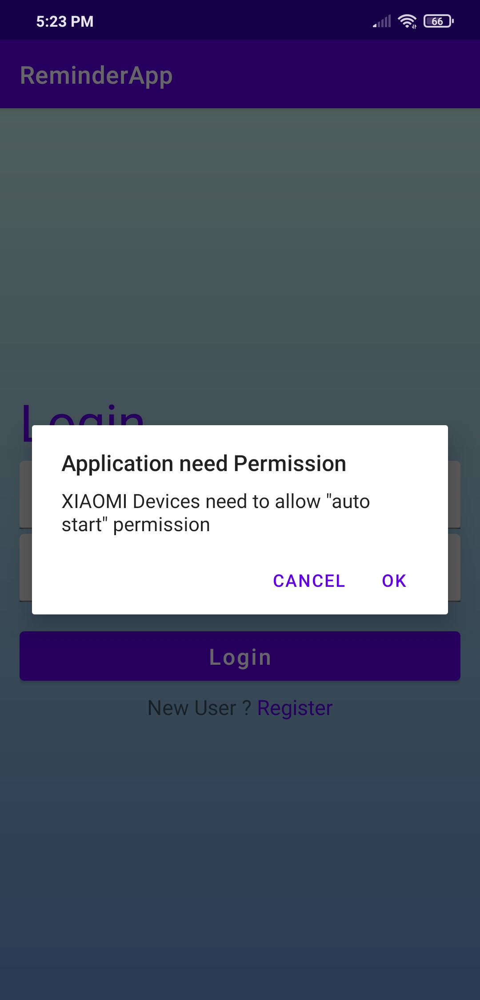
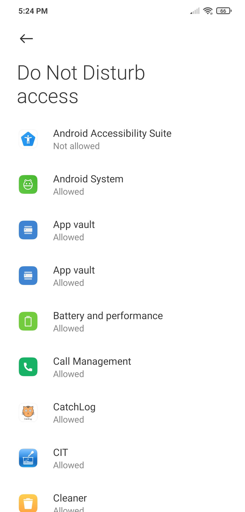
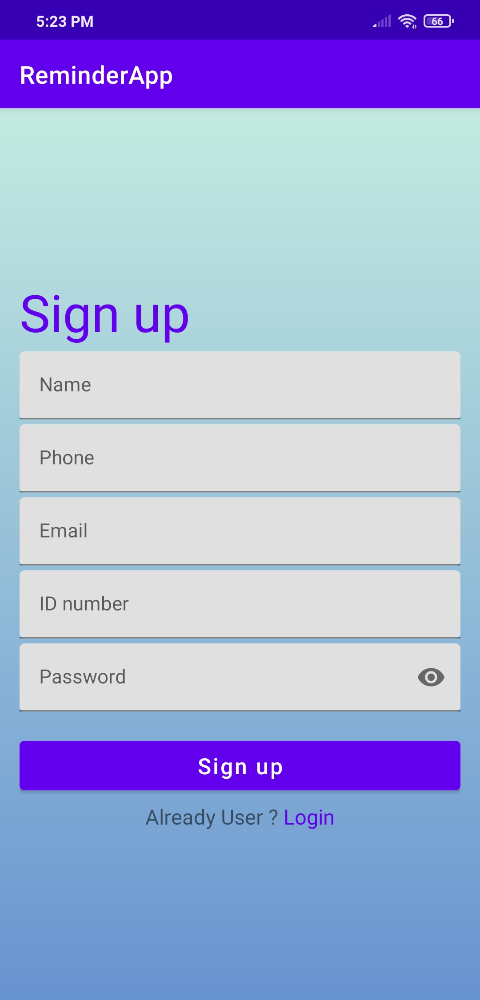
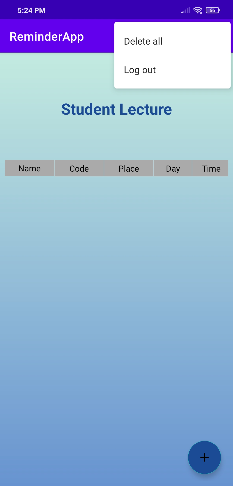
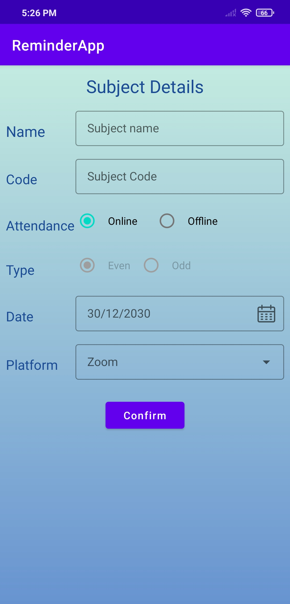
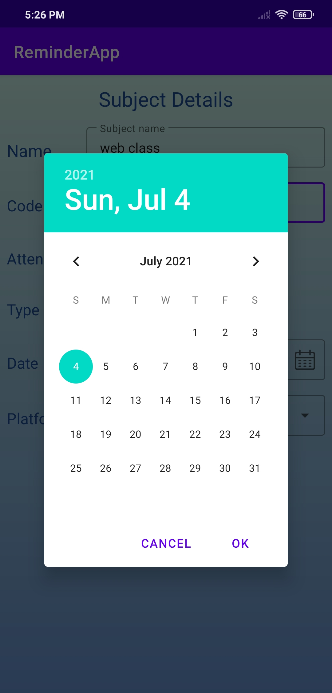
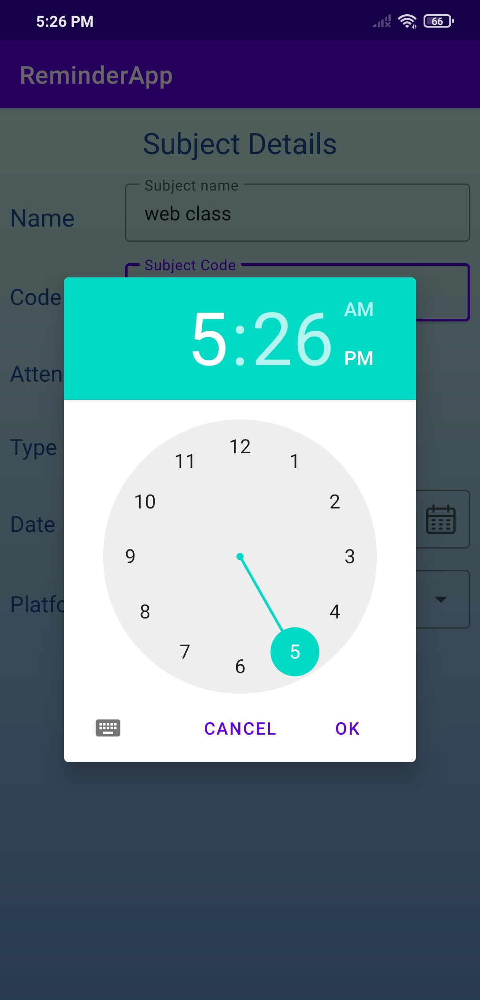
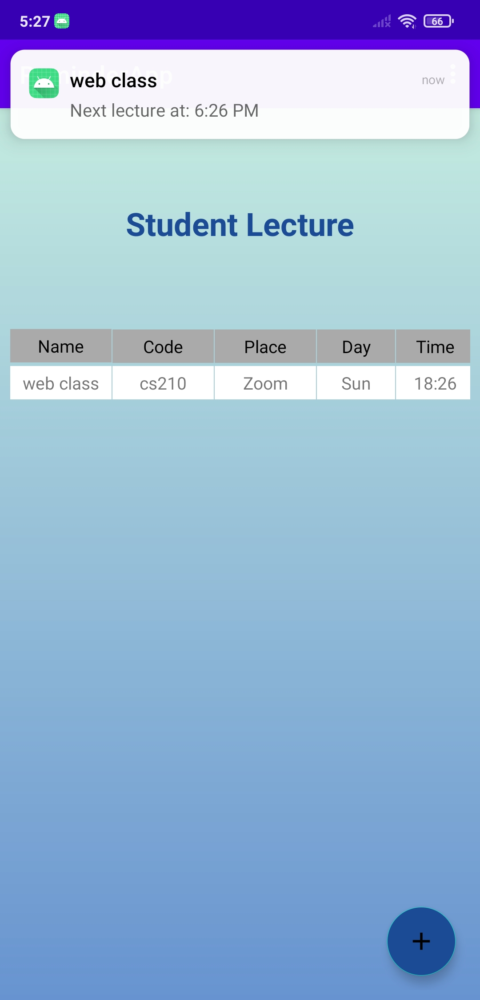

# Lectures Reminder

Reminder is a alarm app to notify you for your lectures and events.

it uses two factors in reminding :

EVEN : it repeats every 14 days.
ODD : repeats every 7 days

## Getting Started

download the repo as zip file or you can clone it from link below:

```
https://github.com/Ahmed-P-Mostafa/ReminderApp.git
```

### Prerequisites

The things you'll need in order to use the app and how to install them
* You need to accept the app auto start
* allow app do not disturb access

 


### How to use

  

  

[View all screenshots](docs/all-screenshots.md)


## Built with

* [Kotlin 1.5.10](https://kotlinlang.org/) - The programming language used
* MVVM - Design Pattern
* Room - The local database
* Alarm Manager
* Broadcase Receivers and Services
* Firebase Authentication

